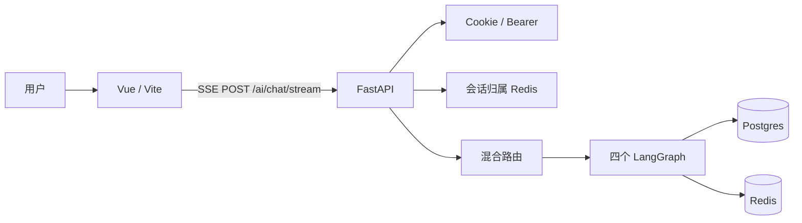

<div align="center">

# VAgent

**ViewHub 的 AI 智能助手**

提供视频内回答、个性化视频推荐、个人数据查询与平台使用帮助。

</div>

---

## 默认路径（面试 / 演示先讲这条）

一次请求只进 **一个** 工作流（视频内回答 / 推荐 / 个人数据 / 闲聊）。编排默认是 **LangGraph workflow 图**，不是全站 ReAct。启动日志和 `GET /ai/admin/features` 的 `default_path` 写的就是这条，ASR / LoRA / `orchestration_mode=agent` 都不是默认。

主流程给出可展示结果后 **不再跑闲聊**。只有主流程空结果 / 失败时才串行启用闲聊兜底。

视频 ASR、意图 LoRA 默认关闭，且 `LOCK_DEFAULT_PATH=true`（默认）时环境变量也打不开；要试这些能力先设 `LOCK_DEFAULT_PATH=false`。闲聊联网只走 **Bing（有 Key）和百度**。**视频内回答只走当前视频的 keyword + 向量**。compose 钉死 ParadeDB 镜像版本；有 `DEEPSEEK_API_KEY` 时走真实 LLM，没 Key 才 replay。种子库含 12 条已索引视频，推荐和个人数据可独立演示。

本仓可独立演示（见下方 compose）：启动写入 12 条种子；运维页「本仓登记视频」可再入库索引，不依赖 Java 上传。接 ViewHub 时仍可用播放页 `?video=`。

## 功能

- 当前视频内回答（有 `video_id` + 索引时）：改写 → 双路召回 → EvidenceGate → 可选 Bounded ReAct → 引用（含时间点）
- 个性化 / 冷启动推荐：主站点赞、收藏、播放记录画像（tags / 分区）
- 用户点赞、收藏、播放历史查询（含今天 / 本周）
- 平台使用帮助与客服对话
- 多轮对话（Redis 短期）与跨会话记忆（Postgres）
- 赞踩反馈影响下次推荐排序
- 意图路由：关键词 + 语义 + 分歧时 LLM；决策经 SSE `meta` 可见
- 多模态：需将 `LLM_PROVIDER` 配成 `deepseek-vl`（图文）；默认文本模型不看图

## 架构



## 快速开始

本仓独立演示（Postgres + Redis + API + 前端，含已索引视频 `demo01`）：

```bash
docker compose up -d --build
```

- 前端：http://localhost:4091 （已带入 `demo01`，问「这个视频讲了什么」应出引用；「随便聊聊」走闲聊）
- API：http://localhost:9090/docs
- 演示登录（仅 compose，未写进登录页）：`demo@vagent.local` / `vagent-demo`
- 根目录 `.env` 填了 `DEEPSEEK_API_KEY` 则走真实模型；否则 LLM replay

接 ViewHub 全站时仍在 ViewHub 目录 `docker compose up`，`.env` 里 `VAGENT_ROOT` 指向本仓。

本仓本地开发：Vite http://localhost:4000 ，代理到 FastAPI http://localhost:9090。

测试账户不要写进登录页。需要时在后端 `.env` 打开 `TEST_ACCOUNT_*`（不要用 `123456`，见根目录 `.env.example`）。

## 测试

```bash
# 后端（覆盖率门槛 75%，app 无 omit）
cd ai-end && python -m pytest tests/ -q --cov=app

# 前端（statements/lines 75%；含 views）
cd ai-frontend && npx vitest run --coverage

# Playwright：citations 刷新契约（mock SSE）
cd ai-frontend && npm run test:e2e
```

CI（`.github/workflows/ci.yml`）后端在 pytest + ruff 之后跑这些 **离线** 脚本：

- `workflow_golden_set.py`
- `behavior_golden_set.py`
- `intent_ternary_regression.py`
- `synonym_video_qa_eval.py`（命中 14 + 硬负例拒答 8 = **22/22**）
- `memory_regression.py`
- `sse_regression.py --offline`
- `promote_weekly_golden.py --dry-run`

下列脚本在 README 里可作本机评测，**当前不进 CI**：`golden_set.py`（融合大盘）、`ablate_recall.py`、`replay_trace.py`。路由 80.7% 等 live 数字见 [`docs/metrics.md`](docs/metrics.md)；**面试只把 [`docs/ci_metrics.md`](docs/ci_metrics.md) 说成门禁**。

更多评测与 RAG 说明见下文「Agentic Video RAG」。演示请自行录一段主路径（登录 → `?video=` 问答出引用 → 推荐或个人数据 → 历史），仓库不存放录屏文件。

## Agentic Video RAG

针对**当前正在看的这个视频**做问答：不是一次性 RAG，而是轻量 Agent 闭环（只搜本视频内容，避免跨视频串答）：

1. **Query rewrite**：规则口语扩展 + 可选 LLM 关键词改写
2. **检索漏斗**：`recall_budget` → `rerank_candidate_limit` → `default_top_k`（启动校验单调收窄）
3. **批级 EvidenceGate**：最高精排分低于阈值则整批不进 LLM
4. **当前视频混合召回**：`pgvector` + ParadeDB BM25，并过滤掉其他视频的片段；证据不足则多轮补搜
5. **Corrective**：启发式 + 可选 LLM judge 校验证据支撑
6. **Bounded ReAct**：检索节点最多 3 次 `search_video_chunks`（`video_qa_react`，视频内回答默认开）
7. **Citations**：结构化引用经 SSE 回传并持久化到 `chat_history`

检索-only 调试：`GET /ai/rag/eval?question=...&video_id=...`（需登录，不调用答案生成 LLM）。

**Java 索引回调 SLA**：见 [`docs/java-index-callback.md`](docs/java-index-callback.md)  
**运维质量看板**：登录后打开 `/admin`（另需 `X-Admin-Key`）或 `GET /ai/admin/business-quality`

`export VAGENT_DEMO_MODE=1` 启用 LLM replay（**仅 mock LLM**；检索改写 / EvidenceGate / grounding 与生产一致）。

## License

MIT
